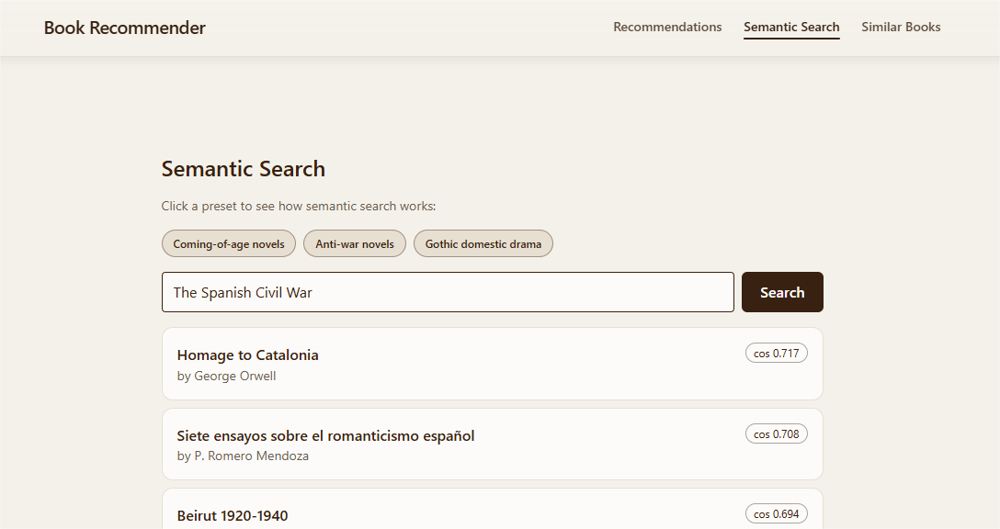
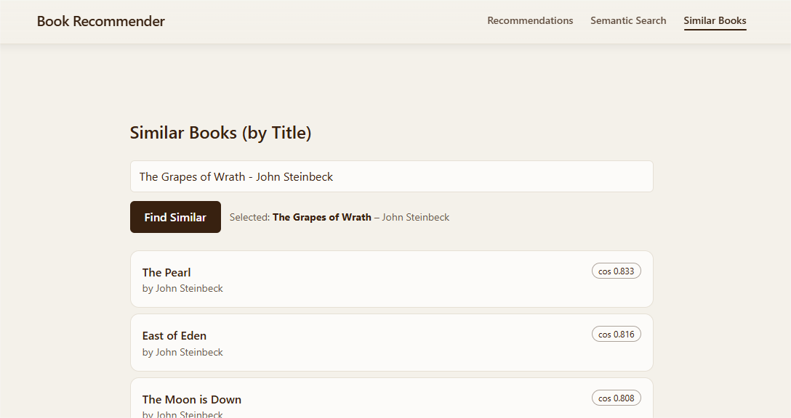

# Explainable Book Recommender

An **AI-powered literary recommender system** built with **FastAPI**, **Postgres + pgvector**, and **Next.js**, designed for *conceptual and explainable book discovery*.

The recommender combines **semantic embeddings** of novels (from Wikipedia summaries and titles) with **user-provided text prompts** - blending free-form *concepts* with *specific works* to find books that exist “between” ideas.


---

## Overview

**Frontend:** Next.js + TailwindCSS  
**Backend:** FastAPI + SQLAlchemy + pgvector  
**Embeddings:** SentenceTransformer (`all-MiniLM-L6-v2`)  
**Database:** PostgreSQL with `pgvector` extension

The system supports three primary modes of interaction:

1. **Semantic Search** - Find books matching a natural-language description.  
2. **Similar Books** - Retrieve nearest neighbors for a given seed novel.  
3. **Hybrid Recommendations** - *Combine* a description and a seed book to discover conceptually blended results.

---

## How It Works

Each book is represented by a **vector embedding** computed from:
- its **title**, and  
- its **Wikipedia or Open Library description**.

These vectors are stored in Postgres using the `pgvector` extension, enabling similarity queries such as:

```sql
SELECT id, title
FROM embeddings
ORDER BY vector <=> :query_vector
LIMIT 10;
```

- `<=>` is the **cosine distance operator**.  
- Smaller distances indicate higher semantic similarity.

When a user provides:
- a **text description**, the phrase is embedded and used directly for the search.  
- a **book**, its stored embedding is retrieved.  
- **both**, the two vectors are combined (weighted average) to form a blended query - surfacing “hybrid” results that lie semantically between the two.

---

## Example: "Spanish Civil War" Fusion

This example demonstrates how different query types behave step-by-step.

### 1. Description-only search



**Interpretation:**  
The system correctly retrieves Orwell’s *Homage to Catalonia* when asked for “Spanish Civil War,” recognizing the historical and political semantics of the phrase.

> *Homage to Catalonia* (George Orwell) - A firsthand account of Orwell’s experiences fighting in the Spanish Civil War, exposing the chaos, political infighting, and disillusionment within the anti-fascist movement.

---

### 2. Seed-only search



**Interpretation:**  
When only a seed novel is given (*The Grapes of Wrath*), the system clusters stylistically and thematically related works - realism, hardship, moral clarity - retrieving similar Steinbeck titles.

> *The Grapes of Wrath* (John Steinbeck) - A powerful Depression-era novel following the Joad family as they migrate from the Dust Bowl to California in search of dignity, survival, and justice.

---

### 3. Combined query


**Interpretation:**  
When both a description (“Spanish Civil War”) and a seed book (*The Grapes of Wrath*) are provided, the blended vector retrieves Hemingway’s *For Whom the Bell Tolls* - a novel that bridges moral struggle and political war themes.

> *For Whom the Bell Tolls* (Ernest Hemingway) - A tragic tale of love, sacrifice, and resistance, following an American dynamiter fighting with Spanish guerrillas during the Spanish Civil War.

---

## Local Development Setup

### Prerequisites

Make sure the following tools are installed:

- [**Poetry**](https://python-poetry.org/docs/#installation) ≥ 1.7  
- [**Docker**](https://docs.docker.com/get-docker/) ≥ 24.0  
- [**Node.js**](https://nodejs.org/en/download) ≥ 18.0

---

### 1. Clone the repository and install dependencies

```bash
git clone https://github.com/donnchadh00/explainable-book-recs.git
cd bookrecs
poetry install
```

### 2. Set up environment variables

Create `.env` for the backend and `.env.local` for the frontend:

```bash
cd backend
cp .env.example .env

cd ../frontend
cp .env.local.example .env.local
```

### 3. Start PostgreSQL (with pgvector)

```bash
# from project root
docker compose up -d db --build
```

### 4. Apply database migrations

```bash
# from backend/
poetry run python -m app.migrations.apply
```

### 5. Ingest OpenLibrary data (choose subjects)

```bash
# from backend/
poetry run python -m etl.openlibrary_ingest   --subject classic_literature --subject world_classics --subject literature   --max-per-source 2000 --editions-limit 30 --concurrency 32 --batch-commit 250   --cache-dir etl_cache
```

You can customize subjects or limits for a smaller dataset.

### 6. Enrich data with Wikipedia summaries

```bash
poetry run python -m etl.enrich_wikipedia --min-chars 999999 --concurrency 24
```

### 7. Build text embeddings

```bash
# from backend/
poetry run python -m app.jobs.embeddings_job
```

### 8. Run backend and frontend

Open two terminals:

```bash
# Terminal A - backend
cd backend
poetry run uvicorn app.main:app --reload --port 8000

# Terminal B - frontend
cd frontend
npm install
npm run dev
```

Then visit **http://localhost:3000**.  
FastAPI docs are available at **http://localhost:8000/docs**.

---

## Key API Routes

| Endpoint | Description |
|-----------|--------------|
| `GET /books/search?q=...` | Search by title or author substring |
| `GET /books/{id}/similar` | Find similar books using vector similarity |
| `GET /semantic?q=...` | Semantic search via free-text query |
| `GET /recommend?seed_book_id=...&q=...` | Hybrid recommendations (vector fusion) |
